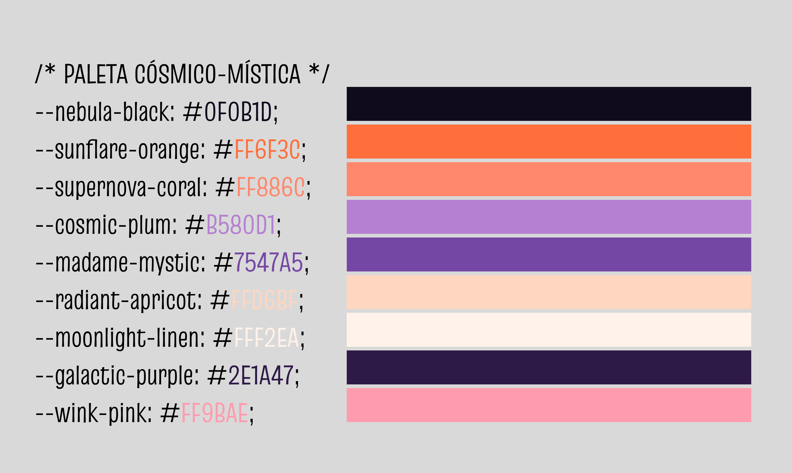
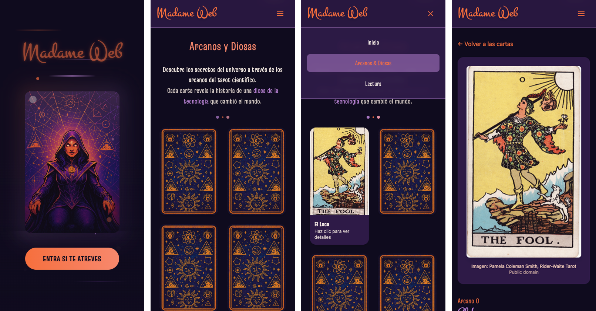

# 🔮 Madame Web

Aplicación web interactiva de tarot científico donde cada carta representa una diosa de la tecnología.  
El proyecto está construido con **React + Vite**, usando **TailwindCSS** para estilos y animaciones, y **Lottie** para recursos animados.  

---

## 📂 Estructura del proyecto

```bash
|-- App.css
|-- App.jsx
|-- index.css
|-- main.jsx
|-- components
|   |-- Card.jsx          # Componente individual (front/back de la carta)
|   |-- CardList.jsx      # Colección de cartas
|   |-- Reading.jsx       # Animación y lógica de lectura
|-- pages
|   |-- About.jsx
|   |-- ArcaneDetail.jsx
|   |-- ArcaneGrid.jsx    # Página principal con paginación
|   |-- ArcaneReading.jsx
|   |-- Home.jsx
|-- router
|   |-- Router.jsx        # Configuración de rutas
|-- services
|   |-- tarotService.js   # funciones de servicio
|-- assets
|   |-- img
|       |-- ani_crystalBall.json
|       |-- img_cardback.png
|       |-- img_fav_crystalBall.svg
|       |-- img_madameWeb.png

```
---

## 🎨 Identidad visual

**Paleta cósmico-mística:**

- Nebula Black `#0F0B1D`  
- Sunflare Orange `#FF6F3C`  
- Supernova Coral `#FF886C`  
- Cosmic Plum `#B580D1`  
- Madame Mystic `#7547A5`  
- Radiant Apricot `#FFD6BF`  
- Moonlight Linen `#FFF2EA`  
- Galactic Purple `#2E1A47`  
- Wink Pink `#FF9BAE`  



**Tipografías usadas:**
- [Montez](https://fonts.google.com/specimen/Montez)  
- [Truculenta](https://fonts.google.com/specimen/Truculenta)  
- [Special Gothic](https://fonts.google.com/specimen/Special+Gothic)  

---

## ⚙️ Librerías y herramientas

- **React 19** + **Vite** → base del proyecto  
- **React Router DOM v7** → enrutado de páginas  
- **TailwindCSS v4.1** → sistema de estilos y utilidades  
- **Lottie React** → animaciones vectoriales (crystal ball)  
- **ESLint** → reglas de linting
- **Vercel** → deployment 

---

## ⚙️ Librerías y herramientas

- **React 19** + **Vite** → base del proyecto  
- **React Router DOM v7** → enrutado de páginas  
- **TailwindCSS v4.1** → sistema de estilos y utilidades  
- **Lottie React** → animaciones vectoriales (crystal ball)  
- **ESLint** → reglas de linting  


---

## 🖌️ Prototipo

Diseño inicial realizado en **Figma**.


---

## 🖼️ Capturas de pantalla

### 🌐 Versión Desktop


### 📱 Versión Responsive


---

## 🚀 Cómo ejecutar el proyecto

1. Clona el repositorio:  
   ```bash
   git clone https://github.com/tuusuario/madame-web.git
   cd madame-web
   ```

2. Instala las dependencias:  
   ```bash
   npm install
   ```

3. Inicia el servidor de desarrollo:  
   ```bash
   npm run dev
   ```

4. Compila para producción:  
   ```bash
   npm run build
   ```

---

## 💡 Mejoras futuras

Cosas que me hubiese gustado implementar en próximas versiones:  
- ✨ Segunda parte de la lectura de cartas, añadiendo un toque de humor.  
- 🤖 Crear mi propia API de predicciones graciosas.  
- 🧑‍🎨 Escribir un **About Me** explicando la historia detrás del proyecto.  
- 🌀 Reemplazar el grid por un carrusel dinámico de la baraja de cartas.  
- 🕸 Animación vectorial con **GSAP** de una telaraña creciendo por toda la web.  

---

## 👩‍💻 Autora

Proyecto desarrollado por **Olga Ramírez** como parte de su formación en desarrollo web.  
Visita [aquí Madame Web](https://madame-web.vercel.app/) 🔮🕷️🕸️
