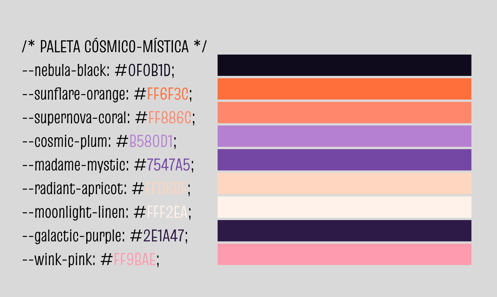
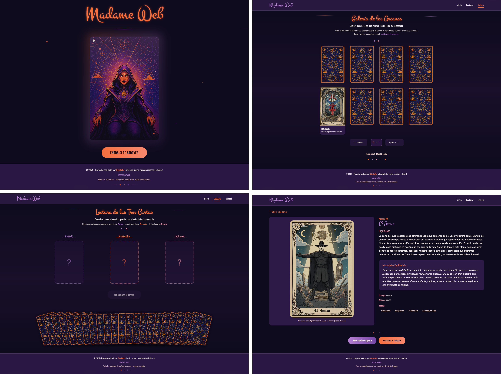
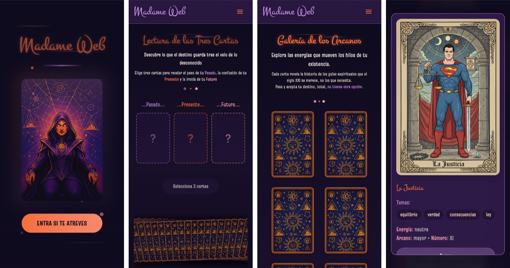

# 🔮 Madame Web - Frontend

> *"El destino te espera... pero primero, consulta la documentación."*

Aplicación web interactiva de tarot desarrollada en React que consume predicciones sarcásticas de una API REST propia. Combina los 22 Arcanos Mayores representados por personajes icónicos de la cultura pop con un sistema de lecturas personalizadas que son más honestas que tu historial de búsqueda.

[](https://madame-web.vercel.app)
[](https://react.dev/)
[](https://vitejs.dev/)
[](https://tailwindcss.com/)

**🌐 App en vivo:** [https://madame-web.vercel.app](https://madame-web.vercel.app)  
**🔗 API Backend:** [https://madame-web-api.onrender.com](https://madame-web-api.onrender.com)  
**📚 Repo Backend:** [madame-web-api](https://github.com/olgararo/madame-web-api)

---

## ✨ Características

- 🃏 **22 Arcanos Mayores** representados por personajes de la cultura pop
- 🎨 **Diseño místico-moderno** con animaciones fluidas y efectos de partículas
- 🔮 **Lectura de 3 cartas** (Pasado, Presente, Futuro) con predicciones dinámicas
- ✍️ **Efecto typewriter** para las predicciones (porque el drama es importante)
- 🎭 **Interpretaciones duales**: significado tradicional + versión realista-sarcástica
- 📱 **Responsive design** adaptado a móvil, tablet y desktop
- 🌈 **Paleta de colores cósmica** con temas de nebulosas y estrellas
- ⚡ **Carga optimizada** con lazy loading y cache del navegador
- 🎪 **Animaciones Lottie** para estados de carga

---

## 🛠️ Tech Stack

| Tecnología | Versión | Uso |
|-----------|---------|-----|
| **React** | 19.2.3 | Librería UI |
| **Vite** | 7.1.0 | Build tool y dev server |
| **React Router DOM** | 7.8.0 | Enrutamiento SPA |
| **Tailwind CSS** | 4.1.12 | Estilos utility-first |
| **Lottie React** | 2.4.1 | Animaciones JSON |
| **ESLint** | 9.32.0 | Linting |
| **SWC** | - | Compilador ultra-rápido |

---

## 📦 Instalación

### Prerequisitos

- Node.js ≥18.0.0
- npm o yarn

### Pasos
```bash
# 1. Clonar el repositorio
git clone https://github.com/olgararo/madame-web.git
cd madame-web

# 2. Instalar dependencias
npm install

# 3. Iniciar en modo desarrollo
npm run dev

# 4. ¡Listo! La app estará en http://localhost:5173
```

---

## 🚀 Scripts Disponibles
```bash
# Desarrollo con hot reload
npm run dev

# Build para producción
npm run build

# Preview del build
npm run preview

# Linting
npm run lint
```

---

## 📂 Estructura del Proyecto
```
madame-web/
│
├── public/                       # Assets estáticos
│
├── src/
│   ├── assets/
│   │   └── img/
│   │       ├── ani_crystalBall.json    # Animación Lottie
│   │       ├── img_cardback.webp       # Dorso de cartas
│   │       ├── img_madameWeb.webp      # Imagen principal
│   │       └── readme_img/             # Capturas para docs
│   │
│   ├── components/
│   │   ├── Card.jsx                    # Carta individual con flip
│   │   ├── CardList.jsx                # Grid de cartas
│   │   └── Reading.jsx                 # (Placeholder)
│   │
│   ├── pages/
│   │   ├── Home.jsx                    # Landing page mística
│   │   ├── ArcanaGrid.jsx              # Galería de 22 arcanos
│   │   ├── ArcanaDetail.jsx            # Detalle individual
│   │   ├── ArcanaReading.jsx           # Lectura de 3 cartas
│   │   └── About.jsx                   # Info del proyecto
│   │
│   ├── services/
│   │   └── tarotService.js             # Cliente API REST
│   │
│   ├── router/
│   │   └── Router.jsx                  # Configuración de rutas
│   │
│   ├── App.jsx                         # Layout principal + navbar
│   ├── App.css                         # Animaciones globales
│   ├── index.css                       # Theme de Tailwind
│   └── main.jsx                        # Punto de entrada
│
├── index.html                          # HTML base
├── vite.config.js                      # Configuración Vite
├── vercel.json                         # Config de deploy
└── package.json                        # Dependencias
```

---

## 🎨 Paleta de Colores

La app usa un tema cósmico-místico con colores definidos en `src/index.css`:

| Color | Hex | Uso |
|-------|-----|-----|
| **Nebula Black** | `#0F0B1D` | Fondo principal |
| **Sunflare Orange** | `#FF6F3C` | Acentos primarios |
| **Supernova Coral** | `#FF886C` | Hovers y gradientes |
| **Cosmic Plum** | `#B580D1` | Títulos místicos |
| **Madame Mystic** | `#7547A5` | Acentos secundarios |
| **Radiant Apricot** | `#FFD6BF` | Texto suave |
| **Moonlight Linen** | `#FFF2EA` | Texto principal |
| **Galactic Purple** | `#2E1A47` | Cards y modales |
| **Wink Pink** | `#FF9BAE` | Detalles decorativos |



---

## 📱 Capturas de Pantalla

### Desktop


### Mobile


### Prototipo Original (Figma)


---

## 🔗 Integración con la API

El frontend consume 3 endpoints de la API REST:
```javascript
// src/services/tarotService.js

// 1. Obtener todos los arcanos
GET /api/arcanas
// → Respuesta: { success: true, data: [...22 arcanos], count: 22 }

// 2. Obtener arcano específico
GET /api/arcanas/:id
// → Respuesta: { success: true, data: {...arcano} }

// 3. Generar predicción
GET /api/prediction?card1=1&card2=5&card3=12
// → Respuesta: { success: true, data: { prediction, cards_used, dominant_energy } }
```

**Configuración de entorno:**
```javascript
const API_BASE_URL = import.meta.env.DEV
  ? "http://localhost:3001/api"           // Desarrollo
  : "https://madame-web-api.onrender.com/api"  // Producción
```

---

## 🎭 Flujo de la Aplicación
```
Home (Landing)
    ↓
ArcanaGrid (Galería)
    ↓
ArcanaDetail (Click en carta)
    
O

ArcanaReading (Lectura 3 cartas)
    ↓
    1. Selecciona 3 cartas del mazo
    2. Revelar → API genera predicción
    3. Efecto typewriter muestra resultado
    4. Click en carta revelada → Modal con detalles
```

---

## 🎬 Animaciones y UX

### Efectos implementados

- ✨ **Flip cards**: Las cartas se voltean con animación 3D
- 📜 **Typewriter effect**: Las predicciones se escriben letra por letra
- 💫 **Partículas flotantes**: Elementos decorativos con `animate-pulse`
- 🌊 **Gradientes dinámicos**: Transiciones suaves de color
- 🔄 **Loading states**: Animación Lottie de bola de cristal
- 🎪 **Hover effects**: Escalado, sombras y brillos
- 📖 **Smooth scroll**: Navegación fluida entre secciones

### Componentes interactivos
```javascript
// Carta con flip
<Card arcana={...} /> 
// → Click 1: Voltea carta
// → Click 2: Navega a detalle

// Mazo en escalera (fan effect)
<div className="deck-spread">
  // → Cartas distribuidas en arco
  // → Hover: Carta sube y se ilumina
```

---

## 🚀 Deploy en Vercel

### Configuración automática

El proyecto incluye `vercel.json` para SPA routing:
```json
{
  "rewrites": [{ "source": "/(.*)", "destination": "/" }]
}
```

### Pasos para deploy
```bash
# 1. Instalar Vercel CLI (opcional)
npm i -g vercel

# 2. Conectar con GitHub
# → Vercel hace auto-deploy en cada push a main

# 3. Variables de entorno (si las necesitas)
# → En Vercel Dashboard → Settings → Environment Variables
```

**URL de producción:** [https://madame-web.vercel.app](https://madame-web.vercel.app)

---

## ⚡ Optimizaciones

### Performance

- ✅ **Lazy loading** de imágenes con formato WebP
- ✅ **Code splitting** automático con Vite
- ✅ **Compresión Brotli** en Vercel
- ✅ **Cache de API** en cliente (1 llamada para 22 arcanos)
- ✅ **Minificación** CSS y JS en producción

### SEO y Accesibilidad

- ✅ Meta tags Open Graph
- ✅ Imágenes con `alt` descriptivo
- ✅ Navegación por teclado
- ✅ Contraste de colores WCAG AA
- ✅ HTML semántico

---

## 🎯 Funcionalidades Destacadas

### 1. Sistema de Cartas Flip
```jsx
const [isFlipped, setIsFlipped] = useState(false);

// Primera interacción: voltea
// Segunda interacción: navega
```

### 2. Predicciones con Typewriter
```javascript
useEffect(() => {
  let timer = setInterval(() => {
    setDisplayedText(fullText.substring(0, currentIndex + 1));
  }, 20); // 20ms por carácter
}, [prediction]);
```

### 3. Mazo en Escalera (CSS Puro)
```css
.deck-card {
  transform: rotate(calc(-15deg + var(--index) * (30deg / var(--total))));
  margin-left: -70px;
}
```

---

## 📝 Roadmap

- [ ] Modo oscuro/claro toggle
- [ ] Guardar lecturas favoritas (LocalStorage)
- [ ] Compartir predicción en redes sociales
- [ ] Audio místico de fondo (opcional)
- [ ] Versión en inglés (i18n)
- [ ] PWA con service worker
- [ ] Sistema de logros/badges
- [ ] Escribir un About Me explicando la historia detrás del proyecto.
- [ ] Animación vectorial con GSAP de una telaraña creciendo por toda la web.

---

## 🐛 Problemas Conocidos

- En Safari móvil, las animaciones CSS pueden tener menos frames
- El efecto typewriter puede desfasarse en conexiones lentas
- Las imágenes de Cloudinary pueden tardar en la primera carga

---

## 🤝 Contribuir

¿Quieres añadir más arcanos, mejorar animaciones o corregir bugs?

1. Fork el proyecto
2. Crea una rama (`git checkout -b feature/digievolucion`)
3. Commit tus cambios (`git commit -m 'Añade mejora'`)
4. Push a la rama (`git push origin feature/digievolucion`)
5. Abre un Pull Request


---

## 🙏 Créditos

- **Diseño UI/UX:** OlgaRaRo (Figma)
- **Iconos:** Google Material Icons
- **Animaciones:** Lottie Files
- **Imágenes de arcanos:** Generadas con Google AI Studio (Nano Banana)
- **Hosting:** Vercel
- **CDN de imágenes:** Cloudinary

---

## 👩‍💻 Autora

**Olga Ramos Rodríguez**  
Pitonisa junior y desarrolladora Full Stack

- GitHub: [@olgararo](https://github.com/olgararo)
- LinkedIn: [Olga Ramírez](https://www.linkedin.com/in/olga-ramirez-rodriguez/)

---

## 🔗 Enlaces Relacionados

- 📚 [Documentación de la API](https://github.com/olgararo/madame-web-api)

---

<div align="center">

**✨ Que el cosmos te acompañe ✨**

*Hecho con sudor, lágrimas y un poco de IA*

[](https://github.com/olgararo/F5-MadameWeb)

</div>